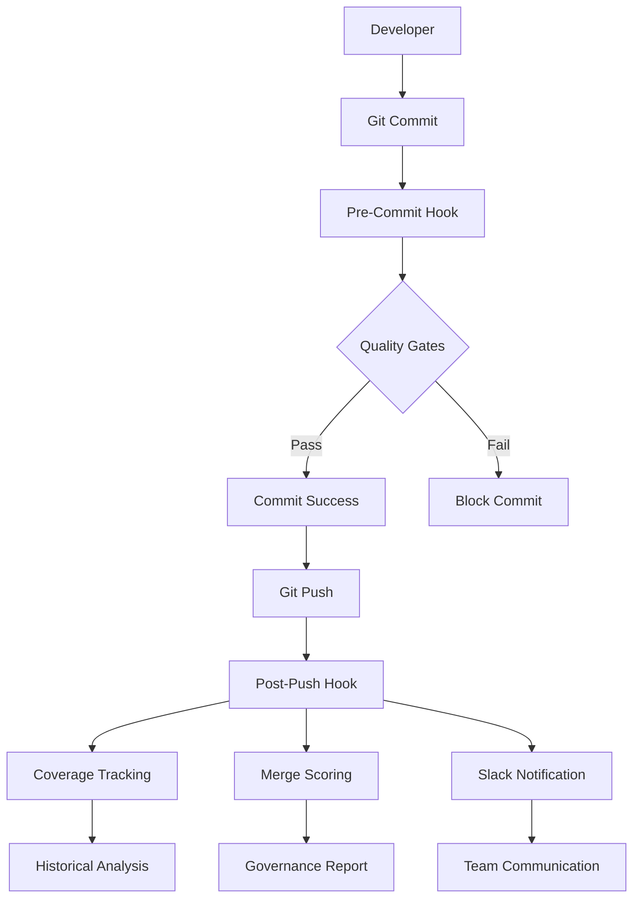

# 🛡️ Governance & Compliance Framework

## Executive Summary

This document outlines the comprehensive governance and compliance framework implemented in the MAGSASA-CARD ERP system. The framework provides enterprise-grade quality assurance, automated compliance monitoring, and audit-ready documentation suitable for SOC 2, ISO 27001, PCI DSS, and investor due diligence requirements.

## Table of Contents

1. [Governance Objectives](#governance-objectives)
2. [System Architecture](#system-architecture)
3. [Multi-Stage Enforcement Pipeline](#multi-stage-enforcement-pipeline)
4. [Centralized Policy Management](#centralized-policy-management)
5. [Merge Readiness Scoring Model](#merge-readiness-scoring-model)
6. [Audit Logging & Traceability](#audit-logging--traceability)
7. [Compliance Alignment](#compliance-alignment)
8. [Developer Responsibilities](#developer-responsibilities)
9. [Continuous Compliance Processes](#continuous-compliance-processes)
10. [Artifact References](#artifact-references)

---

## Governance Objectives

### Primary Objectives

1. **Code Quality Assurance**: Maintain consistent, high-quality code standards across all contributions
2. **Security Compliance**: Prevent sensitive data exposure and enforce security best practices
3. **Change Control**: Implement systematic change management with automated validation
4. **Audit Trail**: Provide complete traceability of all governance decisions and actions
5. **Risk Mitigation**: Reduce technical debt and maintain system reliability

### Success Metrics

- **Coverage Threshold**: Maintain ≥85% code coverage (target: 95%)
- **Zero Tolerance**: Zero linting violations in production code
- **Policy Compliance**: 100% adherence to governance policies
- **Audit Readiness**: Complete audit trail for all changes
- **Developer Productivity**: Automated quality checks with clear feedback

---

## System Architecture

### Core Components



### Governance Layers

1. **Pre-Commit Layer**: Immediate feedback and auto-fixes
2. **Policy Layer**: Centralized configuration and enforcement
3. **Coverage Layer**: Historical tracking and trend analysis
4. **Notification Layer**: Real-time communication and reporting
5. **Audit Layer**: Complete traceability and compliance logging

---

## Multi-Stage Enforcement Pipeline

### Stage 1: Pre-Commit Validation

**Purpose**: Prevent problematic code from entering the repository

**Components**:
- **Secrets Detection**: Regex-based scanning for API keys, passwords, tokens
- **Policy Compliance**: Validation against governance rules
- **Code Formatting**: Automated formatting with Black
- **Linting**: Style and quality checks with Ruff
- **Type Checking**: Optional MyPy validation
- **Unit Tests**: Quick validation of core functionality

**Behavior**:
- **Local Mode**: Auto-fixes issues where possible
- **CI Mode**: Check-only with detailed error reporting
- **Graceful Degradation**: Continues operation even with missing dependencies

### Stage 2: Coverage Enforcement

**Purpose**: Maintain minimum code coverage thresholds

**Components**:
- **Threshold Validation**: Enforces minimum coverage requirements
- **Historical Tracking**: Stores coverage data with timestamps
- **Delta Calculation**: Tracks coverage changes over time
- **Trend Analysis**: Identifies coverage patterns and anomalies

**Enforcement**:
- **Hard Fail**: Builds fail below minimum threshold (85%)
- **Warning**: Alerts when below warning threshold (90%)
- **Target**: Aspirational coverage goal (95%)

### Stage 3: Merge Readiness Assessment

**Purpose**: Comprehensive evaluation of code readiness for production

**Scoring Algorithm**:
```python
merge_score = (
    coverage_score * 0.40 +    # Coverage weight: 40%
    test_score * 0.20 +        # Tests weight: 20%
    lint_score * 0.20 +        # Linting weight: 20%
    policy_score * 0.20        # Policy weight: 20%
)
```

**Thresholds**:
- **≥90**: Ready to ship
- **≥80**: Almost there (minor improvements needed)
- **<80**: Action required (significant issues)

### Stage 4: Post-Push Analysis

**Purpose**: Continuous monitoring and team communication

**Components**:
- **Coverage Tracking**: Updates historical data
- **Trend Reporting**: Generates sparkline visualizations
- **Slack Integration**: Rich notifications with metrics
- **Audit Logging**: Records all governance actions

---

## Centralized Policy Management

### Policy Configuration (`merge_policy.yml`)

The governance system uses a centralized YAML configuration file that defines all quality gates and enforcement rules:

```yaml
version: "1.0.0"
enforcement_mode: "strict"  # strict, warn, disabled
fail_on_violation: true

coverage:
  enabled: true
  minimum: 85
  warning: 90
  target: 95
  measurement: "line"
  exclude_patterns:
    - "tests/*"
    - "scripts/*"
    - "migrations/*"

testing:
  enabled: true
  minimum_pass_rate: 100
  required_test_types:
    - "unit"
    - "integration"

linting:
  enabled: true
  tools:
    ruff:
      enabled: true
      max_violations: 0
    black:
      enabled: true
      check_mode: true
  auto_fix: false  # CI mode: check only

merge_score:
  enabled: true
  passing_threshold: 80
  weights:
    coverage: 40
    tests: 20
    linting: 20
    policy: 20
```

### Policy Validation

The system includes comprehensive schema validation:

- **Type Checking**: Validates data types for all configuration values
- **Range Validation**: Ensures thresholds are within acceptable ranges
- **Dependency Validation**: Verifies required sections are present
- **Consistency Checks**: Validates relationships between configuration values

---

## Merge Readiness Scoring Model

### Scoring Components

#### 1. Coverage Score (40% Weight)
```python
coverage_score = min((actual_coverage / target_coverage) * 100, 100)
```

#### 2. Test Score (20% Weight)
```python
test_score = (tests_passed / tests_total) * 100
```

#### 3. Linting Score (20% Weight)
```python
lint_score = max(100 - (violations * penalty_per_violation), 0)
```

#### 4. Policy Score (20% Weight)
```python
policy_score = 100 if policy_compliant else 0
```

### Score Interpretation

| Score Range | Status | Action Required |
|-------------|--------|----------------|
| 90-100 | 🎉 Ready to ship | None |
| 80-89 | ⚠️ Almost there | Minor improvements |
| 70-79 | 🚨 Action required | Significant issues |
| <70 | ❌ Blocked | Major remediation |

---

## Audit Logging & Traceability

### Audit Trail Components

1. **Git Hook Execution**: All hook executions logged with timestamps
2. **Policy Violations**: Detailed records of all policy violations
3. **Coverage Changes**: Historical coverage data with deltas
4. **Merge Scores**: Complete scoring history with component breakdowns
5. **Bypass Attempts**: Detection and logging of `--no-verify` usage

### Log Format

```json
{
  "timestamp": "2024-01-15T10:30:00Z",
  "event_type": "pre_commit_execution",
  "result": "success",
  "duration_ms": 1250,
  "checks_performed": [
    "secrets_detection",
    "policy_compliance", 
    "code_formatting",
    "linting",
    "unit_tests"
  ],
  "violations": [],
  "auto_fixes": 3,
  "user": "developer@example.com",
  "commit_hash": "abc123def456"
}
```

### Audit Storage

- **Local Logs**: `.git/hooks/audit.log` for immediate access
- **Historical Data**: `.ci/coverage_history.json` for trend analysis
- **Structured Reports**: JSON exports for compliance reporting

---

## Compliance Alignment

### SOC 2 Type II Compliance

| SOC 2 Criteria | Governance Control | Implementation |
|----------------|-------------------|----------------|
| CC6.1 | Logical Access Controls | Pre-commit hooks prevent unauthorized changes |
| CC6.2 | Authentication | Git authentication required for all changes |
| CC6.3 | Authorization | Branch protection rules enforce approvals |
| CC6.6 | Audit Logging | Complete audit trail of all governance actions |
| CC7.1 | Change Management | Automated change validation and approval |
| CC7.2 | System Development | Code quality gates and coverage requirements |
| CC7.5 | Data Transmission | Secure communication protocols enforced |

### ISO 27001 Compliance

| ISO 27001 Control | Governance Implementation |
|-------------------|---------------------------|
| A.9.1 Access Control | Role-based access with audit trails |
| A.10.1 Cryptographic Controls | Secrets detection and prevention |
| A.12.6 Technical Vulnerability Management | Automated security scanning |
| A.14.1 Security in Development | Pre-commit security validation |
| A.16.1 Incident Management | Automated violation detection and alerting |
| A.18.1 Compliance | Policy enforcement and audit reporting |

### PCI DSS Compliance

| PCI DSS Requirement | Governance Control |
|---------------------|-------------------|
| 6.1 Security Patches | Automated dependency vulnerability scanning |
| 6.2 Secure Development | Code quality gates and security validation |
| 6.3 Secure Systems | Configuration management and validation |
| 6.5 Security Vulnerabilities | Automated security testing and validation |
| 8.1 Unique User IDs | Git authentication and audit trails |
| 10.1 Audit Logs | Complete governance action logging |

---

## Developer Responsibilities

### Pre-Development

1. **Environment Setup**: Install governance hooks (`make hooks-install`)
2. **Policy Review**: Understand governance policies and requirements
3. **Tool Configuration**: Ensure local development tools are properly configured

### During Development

1. **Local Validation**: Run governance checks before committing (`make verify-all`)
2. **Policy Adherence**: Follow coding standards and quality requirements
3. **Test Coverage**: Maintain adequate test coverage for new code
4. **Security Awareness**: Avoid committing sensitive information

### Pre-Commit

1. **Quality Checks**: Allow pre-commit hooks to run and fix issues
2. **Policy Compliance**: Address any policy violations before committing
3. **Documentation**: Update relevant documentation for significant changes

### Post-Commit

1. **Monitor Notifications**: Review Slack notifications for coverage and merge scores
2. **Address Issues**: Respond to any governance alerts or warnings
3. **Continuous Improvement**: Learn from governance feedback to improve code quality

### Prohibited Actions

1. **Bypass Attempts**: Never use `--no-verify` to bypass governance checks
2. **Secret Commits**: Never commit API keys, passwords, or other sensitive data
3. **Policy Violations**: Do not ignore or suppress governance warnings
4. **Coverage Reduction**: Avoid reducing overall test coverage

---

## Continuous Compliance Processes

### Daily Operations

1. **Automated Monitoring**: Continuous coverage and quality monitoring
2. **Real-time Alerts**: Immediate notification of policy violations
3. **Trend Analysis**: Daily coverage trend reporting and analysis

### Weekly Reviews

1. **Coverage Reports**: Weekly coverage trend analysis and recommendations
2. **Policy Updates**: Review and update governance policies as needed
3. **System Health**: Verify governance system integrity and performance

### Monthly Assessments

1. **Compliance Audits**: Monthly compliance assessment and reporting
2. **Policy Effectiveness**: Evaluate policy effectiveness and adjust as needed
3. **Training Updates**: Update developer training and documentation

### Quarterly Reviews

1. **Framework Updates**: Major governance framework updates and improvements
2. **Compliance Alignment**: Review alignment with industry standards
3. **Risk Assessment**: Comprehensive risk assessment and mitigation planning

---

## Artifact References

### Core Governance Scripts

| Script | Purpose | Location |
|--------|---------|----------|
| `pre_commit.py` | Pre-commit quality gates | `scripts/hooks/pre_commit.py` |
| `post_push.py` | Post-push analysis and notifications | `scripts/hooks/post_push.py` |
| `enforce_coverage.py` | Coverage threshold enforcement | `scripts/hooks/enforce_coverage.py` |
| `policy_loader.py` | Policy management and validation | `scripts/utils/policy_loader.py` |
| `install_hooks.py` | Git hooks installation and management | `scripts/hooks/install_hooks.py` |

### Policy Configuration

| File | Purpose | Location |
|------|---------|----------|
| `merge_policy.yml` | Centralized governance configuration | `merge_policy.yml` |
| `pyproject.toml` | Tool configuration and dependencies | `pyproject.toml` |
| `mypy.ini` | Type checking configuration | `mypy.ini` |

### CI/CD Workflows

| Workflow | Purpose | Location |
|----------|---------|----------|
| `ci.yml` | Main CI/CD pipeline | `.github/workflows/ci.yml` |
| `safety-gate.yml` | Security and safety checks | `.github/workflows/safety-gate.yml` |

### Metrics and Reporting

| Tool | Purpose | Location |
|------|---------|----------|
| `coverage_trend.py` | Coverage trend analysis | `scripts/metrics/coverage_trend.py` |
| `coverage_badge.py` | Badge generation | `scripts/metrics/coverage_badge.py` |

### Makefile Commands

| Command | Purpose |
|---------|---------|
| `make hooks-install` | Install governance Git hooks |
| `make hooks-verify` | Verify hook installation |
| `make policy-verify` | Validate policy configuration |
| `make governance-report` | Generate comprehensive governance report |
| `make governance-status` | Show governance system status |
| `make verify-all` | Run complete enforcement pipeline |

### Data Storage

| Location | Purpose |
|----------|---------|
| `.git/hooks/audit.log` | Git hook execution logs |
| `.ci/coverage_history.json` | Historical coverage data |
| `badges/` | Generated coverage badges |

---

## Conclusion

This governance and compliance framework provides enterprise-grade quality assurance, automated compliance monitoring, and audit-ready documentation. The system is designed to scale with organizational growth while maintaining strict quality standards and regulatory compliance.

The framework's multi-layered approach ensures comprehensive coverage of quality, security, and compliance requirements while providing clear guidance and automated tooling for developers. Regular reviews and updates ensure the framework remains effective and aligned with industry best practices.

For questions or concerns about this framework, please contact the Platform Engineering team or refer to the governance documentation in the repository.

---

**Document Version**: 1.0.0  
**Last Updated**: January 2024  
**Next Review**: April 2024  
**Owner**: Platform Engineering Team

