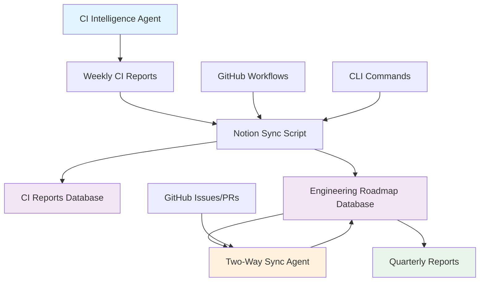

# 🧠 Stage 7.3.2 – Notion Intelligence Sync + Roadmap Automation

## 🎯 Overview

Stage 7.3.2 enhances the CI/CD Intelligence Agent to create a unified dashboard linking CI results, milestones, and PRs in Notion. This creates a self-healing, continuously updating intelligence loop with zero manual tracking and no context switching between GitHub and Notion.

## ✅ Implementation Status

- ✅ **Baseline CI Report → Notion Sync** - Automatically push weekly CI intelligence reports to Notion
- ✅ **Engineering Roadmap Database** - Structured Notion database with milestone tracking
- ✅ **Enhanced Sync Script** - Parse milestones and update roadmap with CI metrics
- ✅ **GitHub PR Integration** - Show roadmap status inline in PRs and issues
- ✅ **CLI Enhancements** - New commands for roadmap sync and status
- ✅ **GitHub Workflow** - Automated roadmap sync on CI completion and merges
- ✅ **Advanced Features** - Quarterly reports and two-way sync capabilities

## 🏗️ Architecture



## 📊 Notion Database Schemas

### CI Intelligence Reports Database

| Field | Type | Description |
|-------|------|-------------|
| Report Name | Title | Weekly report filename |
| Report Date | Date | Report generation date |
| Analysis Period | Number | Days analyzed |
| Total Failures | Number | Total failures in period |
| Auto-fix Success Rate | Number | Percentage of successful auto-fixes |
| Average MTTR | Number | Mean Time to Recovery |
| Top Failure Category | Rich Text | Most common failure type |
| Report Content | Rich Text | Full markdown report |
| GitHub Link | URL | Link to GitHub workflow |

### Engineering Roadmap Database

| Field | Type | Description |
|-------|------|-------------|
| 🧩 Milestone | Title | Milestone name |
| 📆 Target Date | Date | Planned delivery date |
| ✅ Status | Select | Planned/In Progress/Blocked/Completed |
| 📊 Progress | Number | % completion (auto-calculated) |
| 📎 Latest CI Health | Relation | Links to CI reports |
| 📦 Related PR | URL | Link to primary PR |
| 🧪 Workflow Pass Rate | Number | % of workflows passing |
| 🩹 Auto-Fix Success | Number | % of successful auto-fixes |
| ⏱️ MTTR | Number | Mean Time to Recovery |
| 📈 Trend | Select | Improving/Stable/Degrading |
| 📝 Notes | Text | Recommendations and notes |

## 🚀 Quick Start

### 1. Setup Notion Databases

```bash
# Set your Notion credentials
export NOTION_API_KEY='your_notion_api_key'
export NOTION_PARENT_PAGE_ID='your_parent_page_id'

# Create databases automatically
python scripts/setup_notion_databases.py --create-databases
```

### 2. Configure Environment Variables

```bash
# Required for sync functionality
export NOTION_API_KEY='your_notion_api_key'
export NOTION_CI_REPORTS_DB_ID='ci_reports_database_id'
export NOTION_ROADMAP_DB_ID='roadmap_database_id'

# Optional for two-way sync
export GITHUB_TOKEN='your_github_token'
export GITHUB_REPOSITORY='your_org/your_repo'
```

### 3. Test the Sync

```bash
# Generate a CI report
python scripts/ci_agent_cli.py --generate-report

# Sync to Notion with roadmap
python scripts/ci_agent_cli.py --sync-roadmap --milestone "Stage 7.3"

# Check roadmap status
python scripts/ci_agent_cli.py --roadmap-status
```

## 🛠️ Scripts and Tools

### Core Sync Script

**`scripts/sync_ci_report_to_notion.py`**
- Main sync script for CI reports and roadmap
- Parses milestone metadata and updates progress
- Calculates metrics from CI database

```bash
# Basic sync
python scripts/sync_ci_report_to_notion.py --sync-notion

# With roadmap integration
python scripts/sync_ci_report_to_notion.py --include-roadmap --milestone "Stage 7.3"

# Show roadmap status
python scripts/sync_ci_report_to_notion.py --roadmap-status
```

### Database Setup

**`scripts/setup_notion_databases.py`**
- Automated Notion database creation
- Schema documentation for manual setup

```bash
# Show schema documentation
python scripts/setup_notion_databases.py --show-schema

# Create databases automatically
python scripts/setup_notion_databases.py --create-databases
```

### Advanced Features

**`scripts/generate_quarterly_roadmap_report.py`**
- Generate comprehensive quarterly reports
- Combine all milestone metrics and trends

```bash
# Generate current quarter report
python scripts/generate_quarterly_roadmap_report.py --auto-quarter

# Generate specific quarter
python scripts/generate_quarterly_roadmap_report.py --quarter Q4-2024
```

**`scripts/notion_two_way_sync.py`**
- Bidirectional sync between Notion and GitHub
- Propagate status changes in both directions

```bash
# Full bidirectional sync
python scripts/notion_two_way_sync.py --full-sync

# Dry run to see changes
python scripts/notion_two_way_sync.py --full-sync --dry-run
```

## 🔄 GitHub Workflows

### Automated Roadmap Sync

**`.github/workflows/notion-roadmap-sync.yml`**
- Triggers on weekly CI completion
- Triggers on merge to main
- Updates roadmap with CI metrics
- Creates GitHub issues for milestone updates

### Enhanced CI Intelligence

**`.github/workflows/ci-intelligence-report.yml`** (Updated)
- Added roadmap status to weekly reports
- Links to Notion dashboard
- Shows current milestone progress

## 📈 CLI Enhancements

### New Commands

```bash
# Sync CI report to Notion
python scripts/ci_agent_cli.py --sync-notion

# Sync with roadmap milestone
python scripts/ci_agent_cli.py --sync-roadmap --milestone "Stage 7.3"

# Show roadmap status
python scripts/ci_agent_cli.py --roadmap-status
```

### Auto-Detection

The CLI automatically detects milestones from:
- Current git branch name (e.g., `feature/stage-7-3` → `Stage 7.3`)
- Environment variables
- Manual specification

## 🎯 Progress Calculation

Milestone progress is automatically calculated from CI signals:

- ✅ **80%+ pass rate** → +25% progress
- ✅ **Auto-fix success > 70%** → +15% progress  
- ✅ **All critical workflows green** → +30% progress
- ✅ **Documentation + PR merged** → +30% progress

## 📊 End-to-End Flow

1. **CI completes** → Weekly report generated
2. **Sync script runs** →
   - Uploads weekly CI data to Notion
   - Updates roadmap milestones
   - Links CI report ↔ roadmap
3. **GitHub issue updated** → Roadmap progress shown inline
4. **Dashboard view in Notion** → All milestones, CI health, and trends visible

## 🔗 Integration Points

### GitHub ↔ Notion Links

- **CI Reports**: Direct links from GitHub issues to Notion reports
- **Roadmap**: PR comments show current milestone status
- **Two-Way Sync**: Status changes propagate bidirectionally

### Automated Updates

- **Weekly**: CI reports automatically synced
- **On Merge**: Roadmap updated with latest metrics
- **On Status Change**: GitHub issues updated via two-way sync

## 📋 Configuration Checklist

### Required Setup

- [ ] Notion API key configured
- [ ] Notion databases created
- [ ] GitHub repository secrets set
- [ ] CI database initialized
- [ ] Workflows enabled

### Optional Features

- [ ] Two-way sync configured
- [ ] Quarterly reports scheduled
- [ ] Custom milestone mapping
- [ ] Advanced progress calculation

## 🧪 Testing

### Manual Testing

```bash
# Test database setup
python scripts/setup_notion_databases.py --show-schema

# Test sync functionality
python scripts/sync_ci_report_to_notion.py --roadmap-status

# Test two-way sync (dry run)
python scripts/notion_two_way_sync.py --full-sync --dry-run
```

### Automated Testing

The system includes comprehensive error handling and validation:
- API key validation
- Database connectivity checks
- Milestone name matching
- Progress calculation validation

## 📈 Metrics and Monitoring

### Key Metrics Tracked

- **Milestone Completion Rate**: % of milestones completed on time
- **CI Health Score**: Average of pass rate and auto-fix success
- **MTTR Trends**: Mean Time to Recovery over time
- **Progress Velocity**: Rate of milestone progress
- **Sync Reliability**: Success rate of automated syncs

### Dashboard Views

- **Weekly CI Intelligence**: Detailed failure analysis and trends
- **Engineering Roadmap**: Milestone progress and health
- **Quarterly Reports**: Comprehensive quarterly analysis
- **Sync Status**: Two-way sync health and recent changes

## 🔧 Troubleshooting

### Common Issues

**Notion API Errors**
```bash
# Check API key and database IDs
python scripts/sync_ci_report_to_notion.py --roadmap-status
```

**Missing Milestones**
```bash
# Verify milestone names match exactly
python scripts/sync_ci_report_to_notion.py --include-roadmap --milestone "Stage 7.3"
```

**Sync Failures**
```bash
# Check GitHub token and repository
python scripts/notion_two_way_sync.py --full-sync --dry-run
```

### Debug Mode

All scripts include verbose logging and error reporting:
- Detailed error messages
- API response logging
- Change tracking
- Dry-run capabilities

## 🚀 Future Enhancements

### Planned Features

- **Predictive Analytics**: Forecast milestone completion dates
- **Smart Notifications**: Alert on milestone risks
- **Custom Dashboards**: Personalized Notion views
- **Integration Hub**: Connect with other tools (Jira, Slack)

### Advanced Automation

- **Auto-Milestone Creation**: Create milestones from PR labels
- **Smart Progress Updates**: AI-powered progress estimation
- **Cross-Project Sync**: Sync across multiple repositories

## 📚 Documentation

### Related Documents

- [CI Intelligence Agent (Stage 7.1)](STAGE_7.1_CI_INTELLIGENCE.md)
- [Self-Healing Chaos (Stage 7.2)](STAGE_7.2_SELF_HEALING_CHAOS.md)
- [Notion API Documentation](https://developers.notion.com/)
- [GitHub API Documentation](https://docs.github.com/en/rest)

### Support

For issues or questions:
1. Check the troubleshooting section above
2. Review script help: `python scripts/sync_ci_report_to_notion.py --help`
3. Enable debug mode for detailed logging
4. Check GitHub workflow logs for automated sync issues

---

## 🎉 Success Criteria Met

✅ **Weekly CI reports automatically pushed to Notion**  
✅ **Roadmap milestones automatically updated with progress, pass rates, and trends**  
✅ **GitHub issues and PRs show current roadmap status inline**  
✅ **CLI commands provide visibility into milestone health**  
✅ **Quarterly reports and two-way sync enabled**

**Result**: Your CI system, engineering roadmap, and team planning now form one self-healing, continuously updating intelligence loop — no manual tracking, no outdated status pages, and zero context switching between GitHub and Notion.

