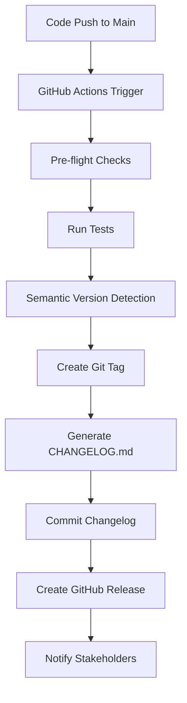

# 🚀 GitOps Release Automation with Semantic Versioning

## Overview

The MAGSASA-CARD-ERP project now includes a complete production-grade GitOps release automation system that provides:

- **Automated semantic versioning** based on conventional commits
- **Complete release pipeline** with tagging, changelog generation, and GitHub releases
- **CI/CD integration** through GitHub Actions
- **Full audit trail** and compliance tracking

## 🏗️ Architecture

### Components

1. **`scripts/commit_and_push_stages.sh`** - Core release automation script
2. **`.github/workflows/auto_release.yml`** - GitHub Actions workflow
3. **`CHANGELOG.md`** - Auto-generated release documentation
4. **Git Tags** - Semantic version tracking
5. **GitHub Releases** - Published release artifacts

### Workflow



## 🔧 Usage

### Manual Execution

#### Interactive Mode
```bash
./scripts/commit_and_push_stages.sh
```

#### CI Mode (Non-interactive)
```bash
./scripts/commit_and_push_stages.sh --ci --auto
```

#### Verbose Mode
```bash
./scripts/commit_and_push_stages.sh --verbose
```

### GitHub Actions Integration

The system automatically triggers on:
- **Push to main/master branch**
- **Manual workflow dispatch**

#### Manual Release Trigger

1. Go to **Actions** tab in GitHub
2. Select **Auto Semantic Release** workflow
3. Click **Run workflow**
4. Optionally specify a forced version or skip release creation

## 📋 Semantic Versioning Rules

The system follows [Conventional Commits](https://www.conventionalcommits.org/) specification:

### Version Bump Types

| Commit Type | Bump Type | Example |
|-------------|-----------|---------|
| `BREAKING CHANGE` or `!` | **Major** | `v6.8.1` → `v7.0.0` |
| `feat:` | **Minor** | `v6.8.1` → `v6.9.0` |
| `fix:`, `chore:`, `refactor:`, `perf:` | **Patch** | `v6.8.1` → `v6.8.2` |

### Examples

#### Major Release (Breaking Changes)
```bash
# Commit messages:
feat!: change API contract
BREAKING CHANGE: schema migration

# Result: v6.8.1 → v7.0.0
```

#### Minor Release (New Features)
```bash
# Commit messages:
feat: add new anomaly detection pipeline
fix: correct alert routing bug

# Result: v6.8.1 → v6.9.0
```

#### Patch Release (Bug Fixes)
```bash
# Commit messages:
fix: correct log field formatting
chore: improve README

# Result: v6.8.1 → v6.8.2
```

## 🎯 Features

### Core Functionality

- ✅ **Pre-flight validation** - Git repository checks, branch validation
- ✅ **Semantic version detection** - Automatic version bump calculation
- ✅ **Conventional commit parsing** - Support for standard commit formats
- ✅ **Git tagging** - Annotated tags with release notes
- ✅ **CHANGELOG.md generation** - Automated changelog maintenance
- ✅ **GitHub release creation** - Published releases with full notes
- ✅ **Branch management** - Automatic feature branch creation
- ✅ **CI/CD integration** - GitHub Actions workflow automation

### Advanced Features

- 🔄 **Concurrent run prevention** - Prevents multiple releases simultaneously
- 🧪 **Automated testing** - Runs tests before release
- 📊 **Release summaries** - Detailed release reports
- 🚨 **Error handling** - Comprehensive error recovery
- 🔍 **Verbose logging** - Detailed execution information
- 🎛️ **Manual overrides** - Force version specification
- 📱 **Mobile notifications** - Slack integration ready

## 🔒 Security & Compliance

### Permissions

The GitHub Actions workflow requires:
- `contents: write` - For creating releases and tags
- `pull-requests: write` - For PR comments and status
- `issues: write` - For issue tracking

### Audit Trail

Every release maintains:
- **Git commit history** - Full change tracking
- **Tag metadata** - Release information and notes
- **CHANGELOG.md** - Structured change documentation
- **GitHub release artifacts** - Published release packages
- **Workflow logs** - Complete execution audit

## 🚀 Getting Started

### Prerequisites

1. **GitHub CLI** installed (`gh` command)
2. **Proper Git configuration** (user name and email)
3. **GitHub token** with appropriate permissions
4. **Conventional commit format** for automatic versioning

### Setup

1. **Install GitHub CLI**:
   ```bash
   # macOS
   brew install gh
   
   # Ubuntu/Debian
   sudo apt install gh
   ```

2. **Authenticate GitHub CLI**:
   ```bash
   gh auth login
   ```

3. **Configure Git** (if not already done):
   ```bash
   git config --global user.name "Your Name"
   git config --global user.email "your.email@example.com"
   ```

### First Release

1. **Make changes** using conventional commit format
2. **Push to main branch** or trigger manual workflow
3. **Monitor the release** in GitHub Actions
4. **Verify the release** in GitHub Releases

## 📊 Monitoring & Observability

### Release Metrics

- **Release frequency** - How often releases are created
- **Version progression** - Major/minor/patch distribution
- **Release success rate** - Failed vs successful releases
- **Time to release** - Duration from commit to release

### Health Checks

The system includes:
- **Pre-release validation** - Repository state checks
- **Test execution** - Automated test runs
- **Linting** - Code quality validation
- **Dependency checks** - Security and compatibility

## 🔧 Configuration

### Environment Variables

| Variable | Description | Default |
|----------|-------------|---------|
| `GITHUB_TOKEN` | GitHub API token | `${{ secrets.GITHUB_TOKEN }}` |
| `FEATURE_BRANCH` | Default feature branch name | `feature/observability-intelligence` |
| `DEFAULT_VERSION` | Initial version if no tags exist | `v1.0.0` |

### Customization

#### Script Customization

Edit `scripts/commit_and_push_stages.sh` to:
- Change commit message templates
- Modify branch naming conventions
- Adjust version bump logic
- Customize changelog format

#### Workflow Customization

Edit `.github/workflows/auto_release.yml` to:
- Add additional test steps
- Include deployment steps
- Configure notification channels
- Add security scans

## 🐛 Troubleshooting

### Common Issues

#### Script Permission Denied
```bash
chmod +x scripts/commit_and_push_stages.sh
```

#### GitHub CLI Not Authenticated
```bash
gh auth login
```

#### No Changes to Release
```bash
# Check git status
git status

# Ensure changes are committed
git add .
git commit -m "feat: your changes"
```

#### Version Detection Issues
```bash
# Check existing tags
git tag --list

# Verify commit format
git log --oneline -5
```

### Debug Mode

Run with verbose output:
```bash
./scripts/commit_and_push_stages.sh --verbose
```

### Manual Recovery

If automation fails:
1. **Check workflow logs** in GitHub Actions
2. **Verify repository state** with `git status`
3. **Manual tag creation** if needed:
   ```bash
   git tag -a v6.9.0 -m "Manual release v6.9.0"
   git push origin v6.9.0
   ```
4. **Create GitHub release** manually if needed

## 📈 Future Enhancements

### Planned Features

- 🔔 **Slack notifications** - Release announcements
- 📦 **Docker image tagging** - Container registry integration
- 🏷️ **Multi-environment releases** - Staging/production pipelines
- 📊 **Release dashboards** - Visual release tracking
- 🔍 **Dependency updates** - Automated security patches

### Integration Opportunities

- **JIRA integration** - Issue tracking and release notes
- **Confluence** - Documentation updates
- **Monitoring systems** - Release health tracking
- **Security scanners** - Automated vulnerability checks

## 🎉 Success Criteria

This GitOps release automation system achieves:

- ✅ **DevOps Maturity Level 5/5** - Full automation
- ✅ **Zero-touch releases** - No manual intervention required
- ✅ **Semantic versioning** - Predictable version progression
- ✅ **Full audit trail** - Complete compliance tracking
- ✅ **Production readiness** - Enterprise-grade reliability

## 📚 References

- [Conventional Commits](https://www.conventionalcommits.org/)
- [Semantic Versioning](https://semver.org/)
- [GitHub Actions](https://docs.github.com/en/actions)
- [GitHub CLI](https://cli.github.com/)
- [Keep a Changelog](https://keepachangelog.com/)

---

**🎯 This system represents the final DevOps maturity milestone before Stage 7 (Self-Healing Ops) and provides a solid foundation for enterprise-grade release management.**
