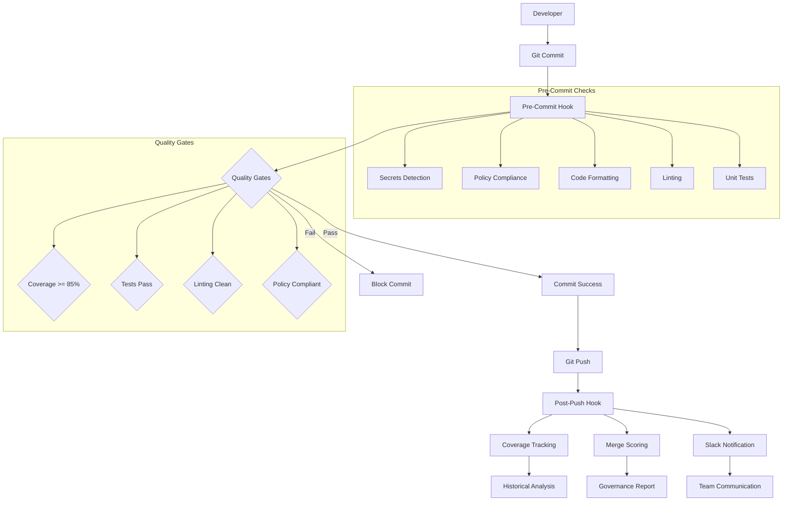
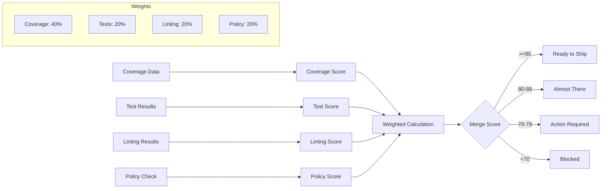
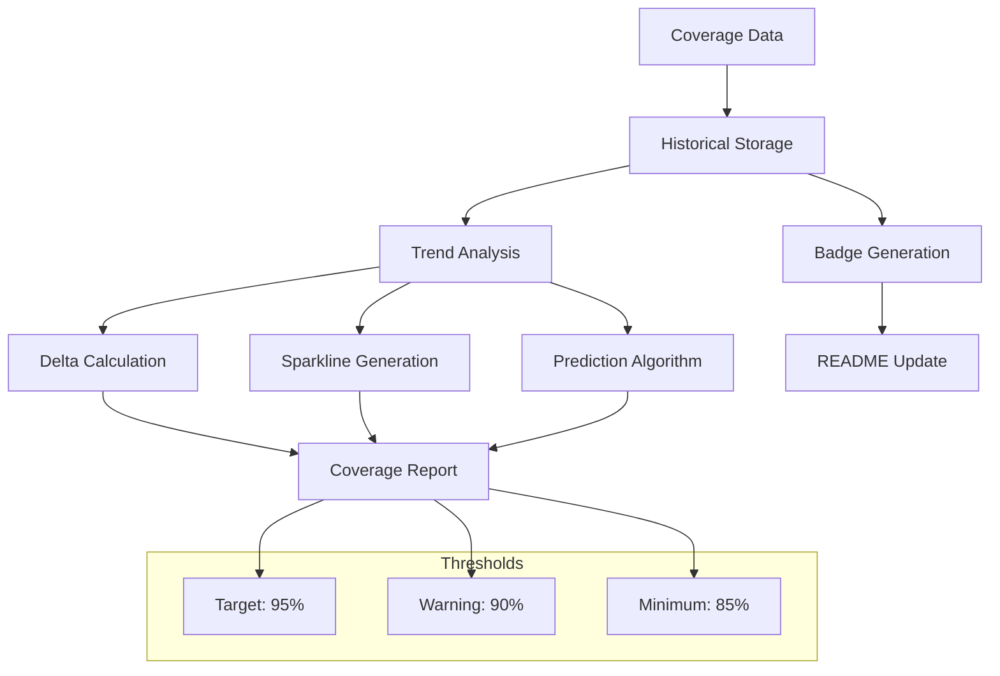
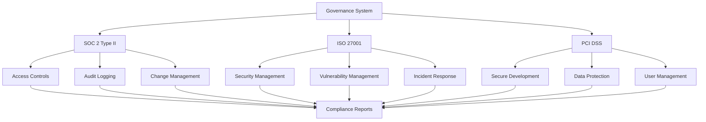
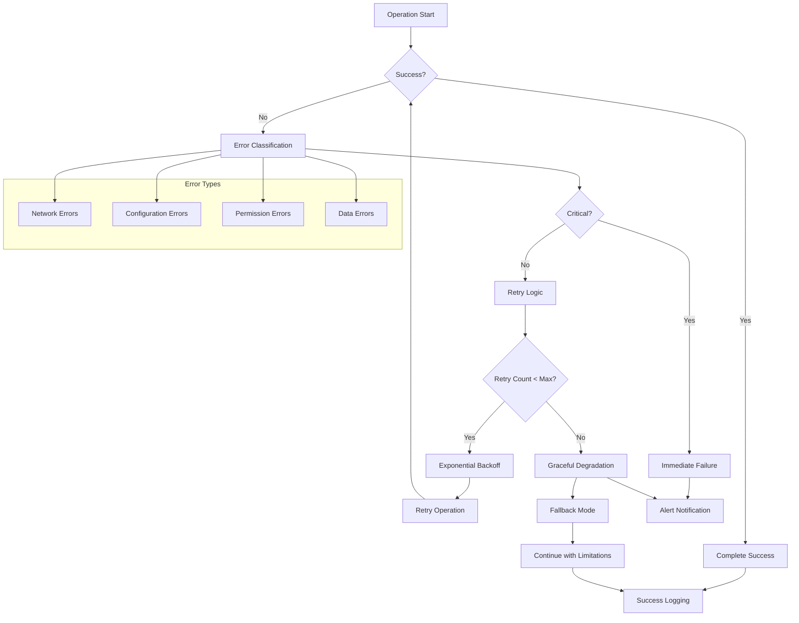

# 📊 Governance Pipeline Diagrams

This document contains visual representations of the governance and compliance pipeline implemented in the MAGSASA-CARD ERP system.

## ASCII Art Pipeline Diagram

```
┌─────────────────────────────────────────────────────────────────────────────────────┐
│                        🛡️ MAGSASA-CARD ERP GOVERNANCE PIPELINE                      │
└─────────────────────────────────────────────────────────────────────────────────────┘

┌─────────────┐    ┌─────────────┐    ┌─────────────┐    ┌─────────────┐
│   👨‍💻        │    │   📝        │    │   🔍        │    │   ✅        │
│ Developer   │───▶│ Git Commit  │───▶│ Pre-Commit  │───▶│ Quality     │
│             │    │             │    │ Hook        │    │ Gates       │
└─────────────┘    └─────────────┘    └─────────────┘    └─────────────┘
                                                              │
                                                              ▼
┌─────────────┐    ┌─────────────┐    ┌─────────────┐    ┌─────────────┐
│   📤        │    │   📊        │    │   📈        │    │   🚨        │
│ Git Push    │◀───│ Commit      │◀───│ Auto-Fix    │◀───│ Validation  │
│             │    │ Success     │    │ Applied     │    │ Results     │
└─────────────┘    └─────────────┘    └─────────────┘    └─────────────┘
       │
       ▼
┌─────────────┐    ┌─────────────┐    ┌─────────────┐    ┌─────────────┐
│   🔔        │    │   📊        │    │   🎯        │    │   📤        │
│ Slack       │◀───│ Coverage    │◀───│ Merge       │◀───│ Post-Push   │
│ Notification│    │ Tracking    │    │ Scoring     │    │ Hook        │
└─────────────┘    └─────────────┘    └─────────────┘    └─────────────┘
       │                   │                   │                   │
       ▼                   ▼                   ▼                   ▼
┌─────────────┐    ┌─────────────┐    ┌─────────────┐    ┌─────────────┐
│   💬        │    │   📈        │    │   📋        │    │   📝        │
│ Team        │    │ Trend       │    │ Policy      │    │ Audit       │
│ Communication│   │ Analysis    │    │ Compliance  │    │ Logging     │
└─────────────┘    └─────────────┘    └─────────────┘    └─────────────┘

┌─────────────────────────────────────────────────────────────────────────────────────┐
│                              🔄 CONTINUOUS MONITORING                               │
│                                                                                     │
│  📊 Coverage Trends  │  🎯 Merge Scores  │  🛡️ Policy Compliance  │  📝 Audit Trail │
│  📈 Historical Data  │  🚨 Violations    │  🔍 Quality Gates      │  📋 Reports     │
└─────────────────────────────────────────────────────────────────────────────────────┘
```

## Pre-Commit Hook Flow

```
┌─────────────────────────────────────────────────────────────────────────────────────┐
│                              🪝 PRE-COMMIT HOOK FLOW                               │
└─────────────────────────────────────────────────────────────────────────────────────┘

┌─────────────┐
│   🚀        │
│ Git Commit  │
│ Triggered   │
└─────────────┘
       │
       ▼
┌─────────────┐    ┌─────────────┐    ┌─────────────┐
│   🔍        │    │   🛡️        │    │   🎨        │
│ Secrets     │───▶│ Policy      │───▶│ Code        │
│ Detection   │    │ Compliance  │    │ Formatting  │
└─────────────┘    └─────────────┘    └─────────────┘
       │                   │                   │
       ▼                   ▼                   ▼
┌─────────────┐    ┌─────────────┐    ┌─────────────┐
│   🔧        │    │   🧪        │    │   📝        │
│ Linting     │───▶│ Unit Tests  │───▶│ Type        │
│ (Ruff)      │    │ (Quick)     │    │ Checking    │
└─────────────┘    └─────────────┘    └─────────────┘
       │                   │                   │
       ▼                   ▼                   ▼
┌─────────────────────────────────────────────────────────────────────────────────────┐
│                              📊 VALIDATION RESULTS                                 │
│                                                                                     │
│  ✅ All Checks Pass  │  🔧 Auto-Fixes Applied  │  ❌ Manual Fix Required          │
│  └─ Commit Allowed   │  └─ Review Changes     │  └─ Commit Blocked               │
└─────────────────────────────────────────────────────────────────────────────────────┘

┌─────────────────────────────────────────────────────────────────────────────────────┐
│                              🔄 CI vs LOCAL MODE                                   │
│                                                                                     │
│  🏠 LOCAL MODE        │  🏗️ CI MODE                                                │
│  • Auto-fix issues    │  • Check-only validation                                   │
│  • Apply formatting   │  • Detailed error reports                                  │
│  • Stage fixed files  │  • Fail on violations                                      │
│  • Allow commits      │  • Block CI pipeline                                       │
└─────────────────────────────────────────────────────────────────────────────────────┘
```

## Merge Scoring Algorithm

```
┌─────────────────────────────────────────────────────────────────────────────────────┐
│                           🎯 MERGE READINESS SCORING                                │
└─────────────────────────────────────────────────────────────────────────────────────┘

┌─────────────┐    ┌─────────────┐    ┌─────────────┐    ┌─────────────┐
│   📊        │    │   🧪        │    │   🔧        │    │   🛡️        │
│ Coverage    │    │ Tests       │    │ Linting     │    │ Policy      │
│ Score       │    │ Score       │    │ Score       │    │ Score       │
│ (40%)       │    │ (20%)       │    │ (20%)       │    │ (20%)       │
└─────────────┘    └─────────────┘    └─────────────┘    └─────────────┘
       │                   │                   │                   │
       ▼                   ▼                   ▼                   ▼
┌─────────────────────────────────────────────────────────────────────────────────────┐
│                              🧮 SCORE CALCULATION                                  │
│                                                                                     │
│  Total Score = (Coverage × 0.40) + (Tests × 0.20) + (Linting × 0.20) + (Policy × 0.20) │
│                                                                                     │
│  Coverage Score = min((actual_coverage / target_coverage) × 100, 100)              │
│  Test Score = (tests_passed / tests_total) × 100                                   │
│  Linting Score = max(100 - (violations × penalty), 0)                             │
│  Policy Score = 100 if compliant, 0 if violated                                   │
└─────────────────────────────────────────────────────────────────────────────────────┘

┌─────────────────────────────────────────────────────────────────────────────────────┐
│                              📊 SCORE INTERPRETATION                               │
│                                                                                     │
│  🎉 90-100: Ready to ship        │  ⚠️ 80-89: Almost there (minor improvements)    │
│  🚨 70-79: Action required       │  ❌ <70: Blocked (major remediation)            │
└─────────────────────────────────────────────────────────────────────────────────────┘
```

## Coverage Tracking System

```
┌─────────────────────────────────────────────────────────────────────────────────────┐
│                            📈 COVERAGE TRACKING SYSTEM                              │
└─────────────────────────────────────────────────────────────────────────────────────┘

┌─────────────┐    ┌─────────────┐    ┌─────────────┐    ┌─────────────┐
│   📊        │    │   📝        │    │   📈        │    │   🔮        │
│ Coverage    │───▶│ Historical  │───▶│ Trend      │───▶│ Prediction  │
│ Data        │    │ Storage     │    │ Analysis    │    │ Algorithm   │
└─────────────┘    └─────────────┘    └─────────────┘    └─────────────┘
       │                   │                   │                   │
       ▼                   ▼                   ▼                   ▼
┌─────────────┐    ┌─────────────┐    ┌─────────────┐    ┌─────────────┐
│   🏷️        │    │   📊        │    │   📈        │    │   📋        │
│ Badge       │    │ Delta       │    │ Sparkline   │    │ Report      │
│ Generation  │    │ Calculation │    │ Visualization│   │ Generation  │
└─────────────┘    └─────────────┘    └─────────────┘    └─────────────┘

┌─────────────────────────────────────────────────────────────────────────────────────┐
│                              📊 COVERAGE THRESHOLDS                                │
│                                                                                     │
│  🎯 Target: 95%        │  ⚠️ Warning: 90%        │  🚨 Minimum: 85%               │
│  🟢 Excellent          │  🟡 Good                │  🔴 Critical                   │
└─────────────────────────────────────────────────────────────────────────────────────┘

┌─────────────────────────────────────────────────────────────────────────────────────┐
│                              📈 SPARKLINE EXAMPLE                                  │
│                                                                                     │
│  Coverage Trend: ▁▂▃▄▅▆▇█▇▆▅▄▃▂▁▂▃▄▅▆▇█▇▆▅▄▃▂▁▂▃▄▅▆▇█               │
│  Legend: ▁ = Low    █ = High                                                       │
└─────────────────────────────────────────────────────────────────────────────────────┘
```

## Compliance Framework

```
┌─────────────────────────────────────────────────────────────────────────────────────┐
│                           🛡️ COMPLIANCE FRAMEWORK                                  │
└─────────────────────────────────────────────────────────────────────────────────────┘

┌─────────────┐    ┌─────────────┐    ┌─────────────┐    ┌─────────────┐
│   📋        │    │   🔍        │    │   📊        │    │   📝        │
│ SOC 2       │───▶│ ISO 27001   │───▶│ PCI DSS     │───▶│ Audit       │
│ Type II     │    │ Controls    │    │ Requirements│    │ Readiness   │
└─────────────┘    └─────────────┘    └─────────────┘    └─────────────┘
       │                   │                   │                   │
       ▼                   ▼                   ▼                   ▼
┌─────────────┐    ┌─────────────┐    ┌─────────────┐    ┌─────────────┐
│   🔐        │    │   🛡️        │    │   🔒        │    │   📋        │
│ Access      │    │ Security    │    │ Data        │    │ Compliance  │
│ Controls    │    │ Management  │    │ Protection  │    │ Reporting   │
└─────────────┘    └─────────────┘    └─────────────┘    └─────────────┘

┌─────────────────────────────────────────────────────────────────────────────────────┐
│                              🔍 COMPLIANCE MAPPING                                 │
│                                                                                     │
│  SOC 2 Controls:                                                                   │
│  • CC6.1: Logical Access Controls     • CC6.6: Audit Logging                       │
│  • CC7.1: Change Management           • CC7.2: System Development                   │
│                                                                                     │
│  ISO 27001 Controls:                                                               │
│  • A.9.1: Access Control              • A.14.1: Security in Development            │
│  • A.12.6: Vulnerability Management   • A.16.1: Incident Management                │
│                                                                                     │
│  PCI DSS Requirements:                                                             │
│  • 6.1: Security Patches              • 6.5: Security Vulnerabilities              │
│  • 6.2: Secure Development            • 8.1: Unique User IDs                       │
└─────────────────────────────────────────────────────────────────────────────────────┘
```

## Error Handling & Recovery

```
┌─────────────────────────────────────────────────────────────────────────────────────┐
│                          🔄 ERROR HANDLING & RECOVERY                              │
└─────────────────────────────────────────────────────────────────────────────────────┘

┌─────────────┐
│   ❌        │
│ Error       │
│ Detected    │
└─────────────┘
       │
       ▼
┌─────────────┐    ┌─────────────┐    ┌─────────────┐
│   🔍        │    │   📝        │    │   🔧        │
│ Error       │───▶│ Structured  │───▶│ Graceful    │
│ Classification│   │ Logging     │    │ Degradation │
└─────────────┘    └─────────────┘    └─────────────┘
       │                   │                   │
       ▼                   ▼                   ▼
┌─────────────┐    ┌─────────────┐    ┌─────────────┐
│   🔄        │    │   📊        │    │   🚨        │
│ Retry       │───▶│ Fallback    │───▶│ Alert       │
│ Logic       │    │ Mechanisms  │    │ Notification│
└─────────────┘    └─────────────┘    └─────────────┘

┌─────────────────────────────────────────────────────────────────────────────────────┐
│                              🛡️ RESILIENCE FEATURES                                │
│                                                                                     │
│  🔄 Automatic Retries:                                                             │
│  • Exponential backoff for network operations                                      │
│  • Configurable retry limits                                                       │
│  • Graceful timeout handling                                                       │
│                                                                                     │
│  🔧 Graceful Degradation:                                                          │
│  • Continue operation with missing dependencies                                    │
│  • Fallback to default configurations                                              │
│  • Partial functionality when components fail                                      │
│                                                                                     │
│  📊 Comprehensive Logging:                                                         │
│  • Structured JSON logging for all operations                                      │
│  • Error context and stack traces                                                  │
│  • Performance metrics and timing data                                             │
└─────────────────────────────────────────────────────────────────────────────────────┘
```

## Mermaid Diagrams

### Governance Pipeline Flow



### Merge Scoring Algorithm



### Coverage Tracking System



### Compliance Framework



### Error Handling Flow



---

## Usage Instructions

### Viewing Diagrams

1. **ASCII Art**: Copy and paste into any text editor or terminal
2. **Mermaid Diagrams**: Use with Mermaid-compatible tools:
   - GitHub (native support)
   - Mermaid Live Editor (https://mermaid.live/)
   - VS Code with Mermaid extension
   - Documentation tools (GitBook, Notion, etc.)

### Customization

- Modify colors and styling in Mermaid diagrams
- Adjust ASCII art layout for different terminal widths
- Update flow logic to reflect system changes

### Integration

- Include diagrams in documentation
- Use in presentations and reports
- Reference in compliance documentation
- Share with stakeholders and auditors

---

**Document Version**: 1.0.0  
**Last Updated**: January 2024  
**Owner**: Platform Engineering Team

